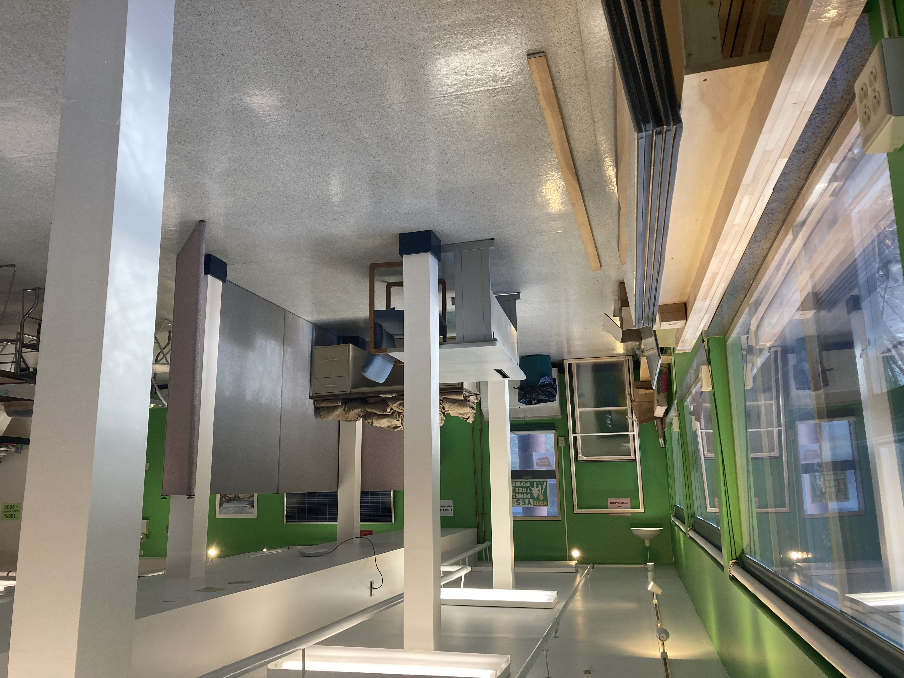

Through a combination of grants and donations, the Community Energy Center at College of the Atlantic is able to offer free home energy audits in Downeast Maine. The program is about to enter its third summer and allows CoA students to kick start careers in sustainable energy and building science while providing a great service to the rural communities around them.

# **Local background**

Maine is the most heating oil dependent state in the country, with 58% of homes using fuel oil as the primary source of heat. In recent years, we have spent more than \$4 billion annually on fossil fuels, resulting in more than 6% of the state's GDP being spent on energy imports. In the last few years, heating oil and kerosene prices doubled from \$2-\$3/gallon to \$5-6/gallon, and stayed above \$4/gallon for the entire year from March 2022 to 2023. At the same time, Maine's electricity prices increased significantly, causing already high household energy costs to nearly double in the last few years.

To compound this issue, Maine has some of the oldest houses in the nation, meaning that many homes are poorly insulated. 56% of the houses in Maine were built before 1980, and most of the homes built since then are not well insulated either. In order to address these issues, Maine has a robust rebate program for energy and efficiency improvements and is developing related workforce training programs.

## Contact Us

Have a question? Contact us below:

**David Gibson -** COA Director of Energy

dgibson\@coa.edu

------------------------------------------------------------------------

*References:*

-   EIA. <https://www.eia.gov/state/data.php?sid=ME#ConsumptionExpenditures>. *Accessed on Feb 6, 2024.*
