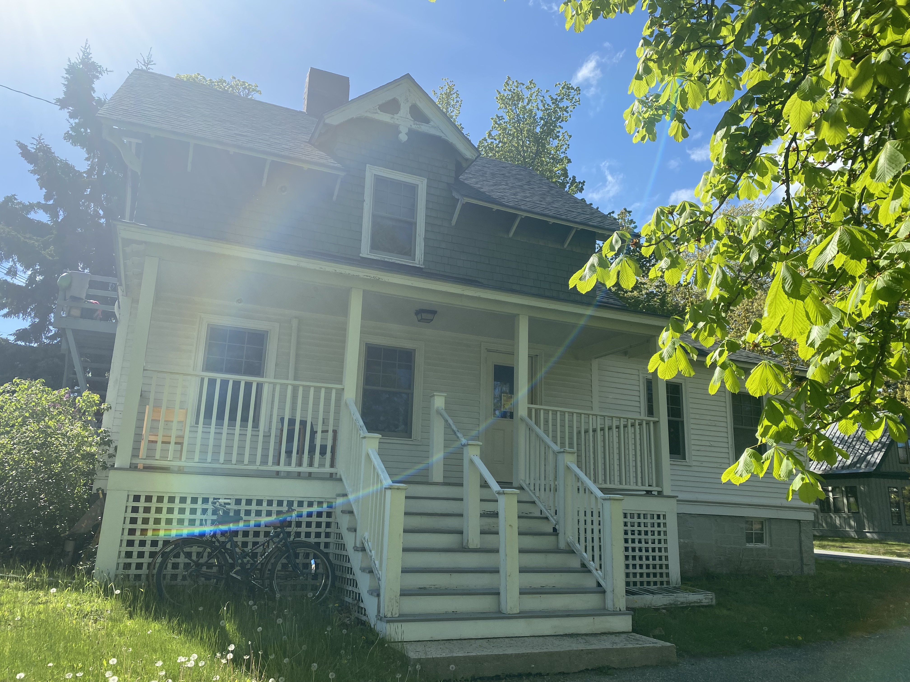
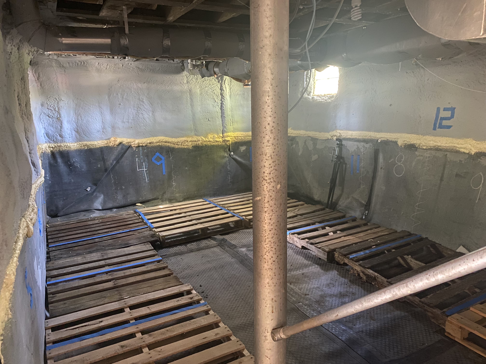
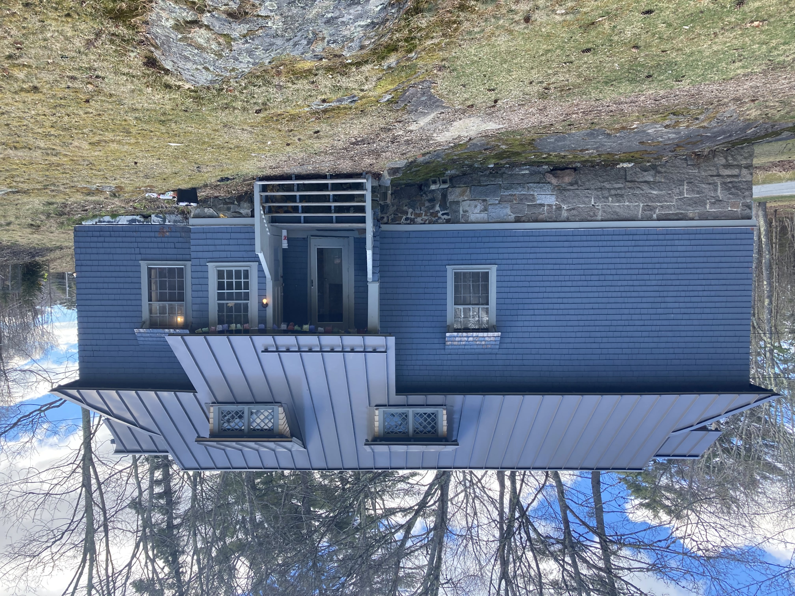
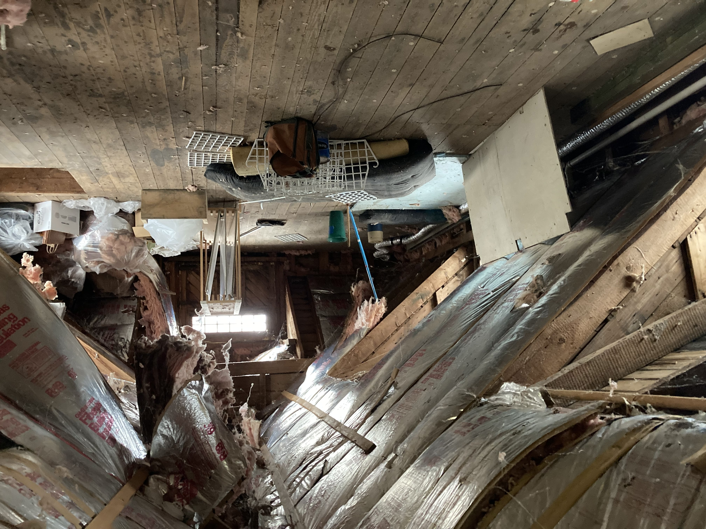
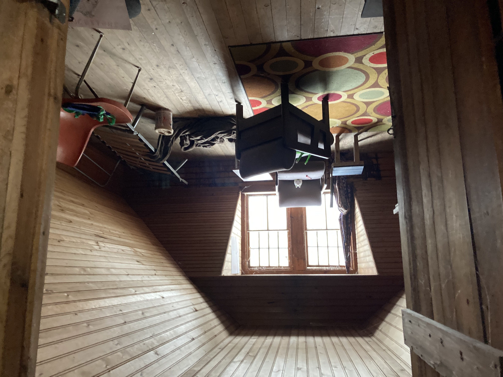

# Home Energy Upgrades Case Studies

A look at two buildings on Collage of the Atlantic's campus and how they have benefitted from energy audits and improvements. Both of these buildings were constructed as single family homes and are used as residences for students and staff.

## Cottage

{fig-alt="Small, white, two story house with a raised stone foundation and a large fenced and covered porch."}

The house we now call Cottage was built in 1880 and is located just next to the main campus entrance. Over the years, students living here have complained about moisture problems, as well as heating and cooling issues.

After conducting a home energy audit, the heating system was switched from a heating oil furnace to a fully electric heat pump system, the domestic hot water was switched to a heat pump water heater, and the basement was sealed with a vapor barrier and insulated with spray foam.

{fig-alt="Image of the basement of Cottage after energy improvements have been made. The walls have been spray foamed and there is thick rubber vapor barrier over the floor and half way up the walls." fig-align="left" width="396"}

These upgrades have resolved the moisture problems, and ensured that the house is heated sufficiently throughout the winter. But that's not all, as is often the case, the audit and improvements came with a few bonus upgrades! The heat pumps are now also able to provide air conditioning in the summer, and the house is no longer using fossil fuels, it is now completely powered by electricity, which has saved us a lot of money as almost all of CoA's electricity is produced by local solar arrays.

------------------------------------------------------------------------

## Carriage

{fig-alt="Image of the front of Carriage house. It is a wide blue house with a standing seem metal roof. There is a stone foundation and steps up to the front porch."}

The Carriage house was built in 1887 and is now used as housing for CoA faculty or staff. Carriage had the same problems as Cottage, moisture problems, and insufficient heating in the winter, as well as getting really hot in the summer.

After conducting a home energy audit, the heating system was switched from a heating oil boiler to a fully electric heat pump system, the domestic hot water was switched to a heat pump water heater, the basement was sealed with a vapor barrier and insulated with spray foam, and the attic was re-insulated and finished.

{fig-alt="Image of Carriage's attic before improvements were made with stuff strewn about the floor and fiberglass batts coming out of the roof cavities" fig-align="left" width="396"}

{fig-alt="Image of Carriges attic after the insulation was fixed and a ceiling was placed." fig-align="left" width="396"}

These upgrades have resolved the moisture problems, and ensured that the house is heated sufficiently throughout the winter. But what about the bonus upgrades? The heat pumps added air conditioning for the summer, the house is no longer using fossil fuels and cheaper to heat and cool, and the attic was converted to usable space.
------------------------------------------------------------------------

**Convinced by the power of home energy improvements? Take the first step by [signing up for an audit here](signuppage.qmd)!**
