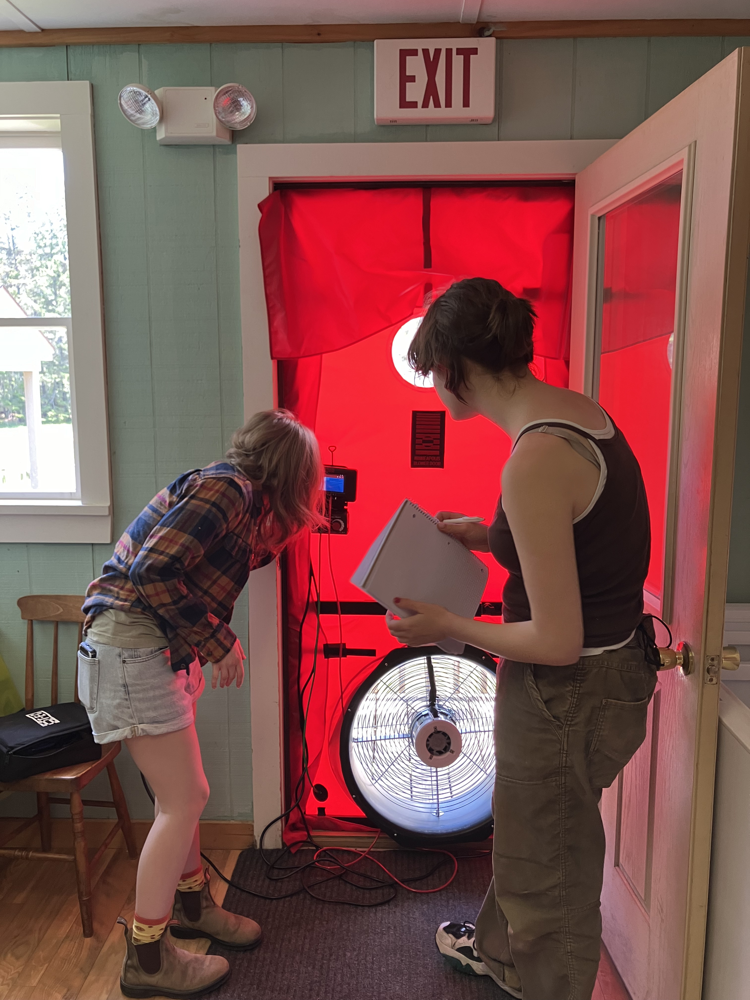

# Our Process

A comprehensive home energy audit is the first step in decreasing your utility bills and increasing the comfort and safety of your home.

An audit will take our team 2 to 4 hours to complete and requires access to all parts of your home, including attic and basement spaces if you have them. After the audit, you will receive a detailed report of our finding and recommendations for upgrades, including financing options and DIY projects. We offer in-person debriefs where we take you through the report and recommendations. It is completely safe for you to stay in your home during all parts of the audit. Here's a more detailed look at what an audit involves:

::: {layout-ncol="2"}
-   We start with a tour of the home and a conversation with you about your concerns and goals for the audit

-   We inspect the inside and outside of your home, including attics, basements, and crawlspaces

-   We measure the efficiency of large household appliances like fridges using a plug-in meter

-   We inspect and run your combustion appliances to test for efficiency and, most importantly, safety

-   We use a blower door test (see picture) to measure the air-tightness of your home and identify major air leaks

{height="400px" fig-align="right" text-align="right" fig-alt="People with the blower door, mesuring the pressure difference"}
:::

Some improvements are inexpensive (or free, in the case of LED light bulbs and high-efficiency shower heads!), while others can be more costly up-front with long-term utility bill reductions. See the 10 Steps from our *10 Steps to a Lower Energy Cost Home* below for examples of improvements we might recommend.

# 10 Steps to Reduce Home Energy Costs!
